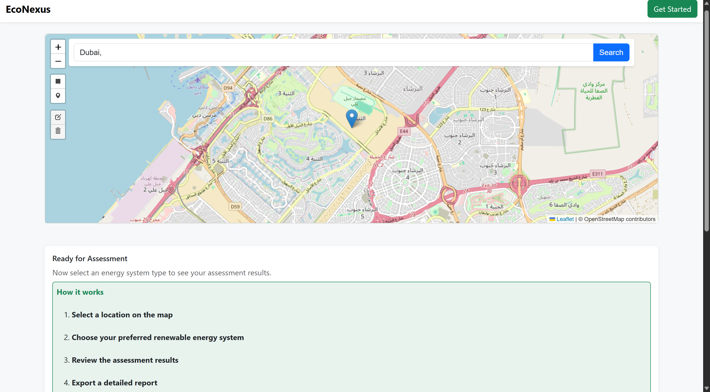
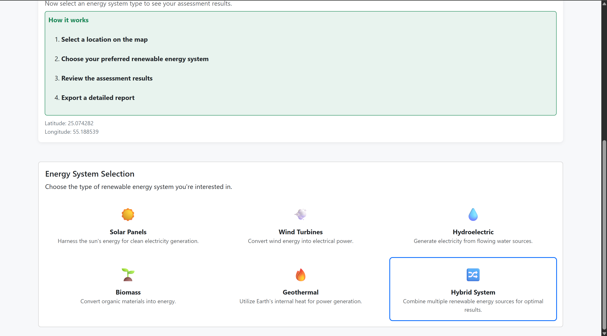
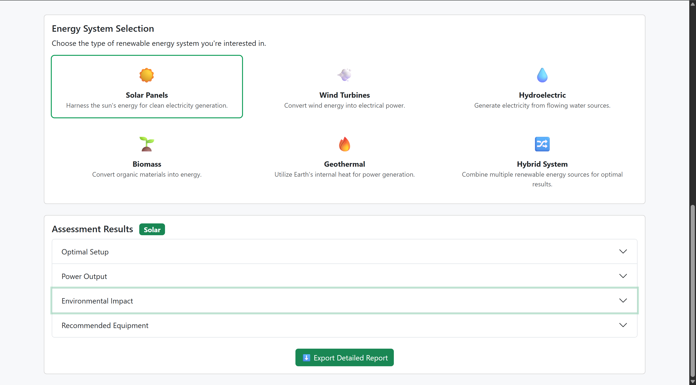
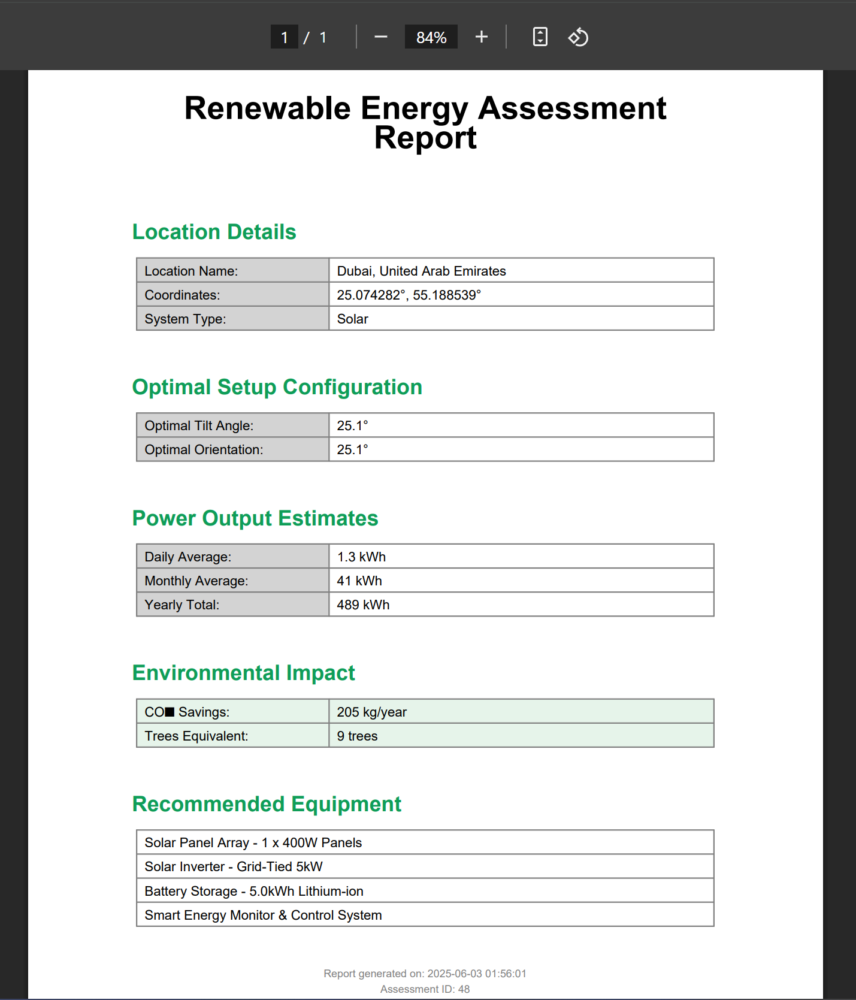
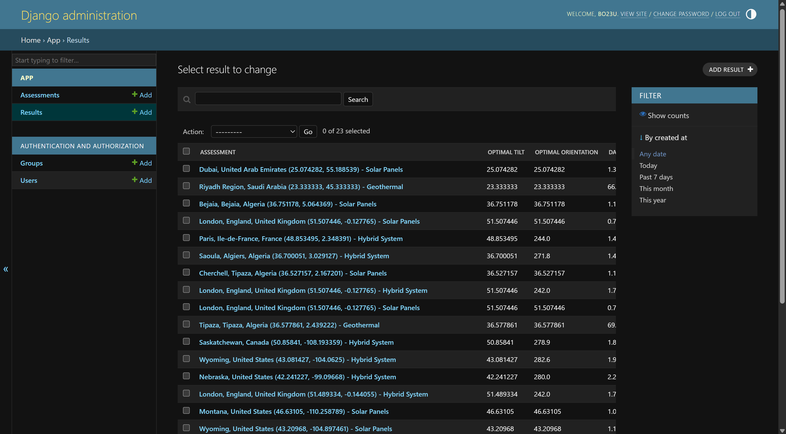

# EcoNexus - Renewable Energy Assessment Platform

EcoNexus is a comprehensive web application that helps users assess and optimize renewable energy solutions for their locations. The platform provides detailed analysis for various renewable energy systems including solar, wind, hydro, biomass, and geothermal power.

## Features

- Multi-source renewable energy assessment
- Location-based climate data analysis
- Detailed power output calculations
- Environmental impact assessment
- Equipment recommendations
- PDF report generation

## Application Screenshots

### 1. Interactive Location Selection

The application features an interactive map interface where users can search and select their location for renewable energy assessment. The map provides precise coordinate tracking and location details.

### 2. Energy System Options

Users can choose from multiple renewable energy systems including:
- Solar Panels
- Wind Turbines
- Hydroelectric
- Biomass
- Geothermal
- Hybrid Systems

### 3. Assessment Results

Detailed assessment results showing:
- Optimal setup configuration
- Power output estimates
- Environmental impact analysis
- Recommended equipment specifications

### 4. PDF Report Generation

Generate comprehensive PDF reports containing:
- Location details
- System specifications
- Power output estimates
- Environmental impact metrics
- Equipment recommendations

### 5. Admin Interface

A powerful admin interface for managing:
- User accounts
- Assessment records
- System configurations
- Data analytics

## Getting Started

[Installation and setup instructions here]

## Technologies Used

- Django 5.2.1
- Python 3.13
- Leaflet Maps
- SQLite Database
- Bootstrap UI Framework

## License

[License information here]

## Contact

[Contact information here]
